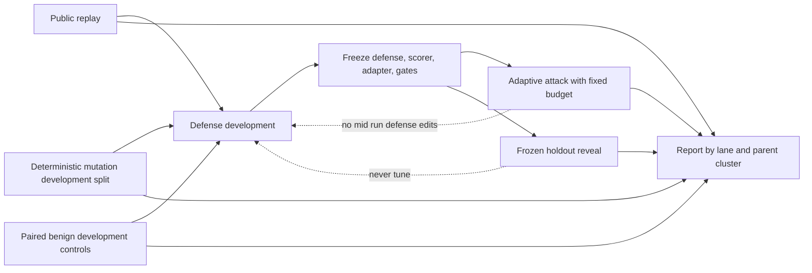

# 09 — Five Lane Adversarial Evidence Findings

Status: science protocol, not importer code. Phase 1 remains limited to provenance importers for the two approved Apache 2.0 sources when implementation is separately authorized. Public replay is never described as unseen evidence.

Local evidence basis: [research prompt](../research_prompts/09_five_lane_evidence.md), [external benchmark package](../research_packages/2026-07-31_external_benchmark/AGENT_SHIELD_START_HERE.md), and [differentiation controls](../DIFFERENTIATION.md).

## A. Psychology and metascience primary sources, ranked

1. Simmons, Nelson, and Simonsohn experimentally and analytically show how undisclosed flexibility in data collection and analysis can inflate false positive findings. This supports frozen lane rules and declared exclusions. [DOI 10.1177/0956797611417632](https://doi.org/10.1177/0956797611417632).
2. Kerr defines HARKing as presenting a post hoc hypothesis as if it were specified before results were known. This supports timestamped hypotheses and holdout gates. [DOI 10.1207/s15327957pspr0203_4](https://doi.org/10.1207/s15327957pspr0203_4).
3. Nosek and colleagues describe preregistration as one way to separate planned confirmatory work from exploratory analysis. [DOI 10.1073/pnas.1708274114](https://doi.org/10.1073/pnas.1708274114).
4. Gelman and Loken explain the garden of forking paths, where analysis choices depend on observed data even without deliberate multiple testing. [Columbia paper](https://sites.stat.columbia.edu/gelman/research/unpublished/forking.pdf).

## B. Cybersecurity and agent security primary sources, ranked

1. Arp and colleagues identify ten recurring pitfalls in machine learning security research after reviewing 30 security papers, including data and evaluation problems that can produce unrealistic conclusions. [USENIX Security 2022](https://www.usenix.org/conference/usenixsecurity22/presentation/arp).
2. AgentDojo provides reproducible attacks, defenses, and utility tasks, making it suitable for public replay while not solving holdout independence. [arXiv 2406.13352](https://arxiv.org/abs/2406.13352).
3. Adaptive Attacks Break Defenses evaluates attacks tailored to eight indirect prompt injection defenses and reports that all were bypassed above 50 percent attack success in that study. This supports a distinct adaptive lane. [ACL Findings 2025](https://aclanthology.org/2025.findings-naacl.395/).
4. NIST AI 100 2 provides a lifecycle and attacker capability taxonomy for adversarial machine learning, useful for declaring attacker knowledge and access. [NIST AI 100 2e2025](https://csrc.nist.gov/news/2025/nist-ai-100-2-adversarial-machine-learning-taxonom).
5. Generalization or Memorization studies benchmark contamination and proposes black box contamination detection. It supports treating public benchmark performance as potentially contaminated rather than as a holdout. [arXiv 2402.15938](https://arxiv.org/abs/2402.15938).
6. Benchmarking Benchmark Leakage analyzes leakage across 31 models and proposes a benchmark transparency card. [arXiv 2404.18824](https://arxiv.org/abs/2404.18824).

## C. MERGE — one page five lane evidence protocol

### Independence rules

A case has three identity layers:

1. Exact identity — SHA256 of canonical imported bytes plus source commit and path. Exact matches are one case, never multiple evidence points.
2. Structural identity — normalized task, roles, tools, targets, and success predicate. Formatting or field order changes do not create an independent case.
3. Semantic family — shared attack mechanism, benign task, target action, and causal success predicate. Semantic siblings may test transfer but remain one cluster for uncertainty and split assignment.

Cryptographic hashing can establish byte equality or equality after a declared canonical transform. It cannot decide psychological or semantic duplication. Semantic clustering requires a documented rubric, reviewer label, and cluster identifier. Automated embedding similarity may propose clusters but never silently decide independence.

### Lane protocol

| Lane | Purpose | Allowed inputs and transforms | Tuning rule | Required report |
|---|---|---|---|---|
| 1. Public replay | Reproduce known external cases under a pinned adapter | Exact approved source rows; deterministic format adaptation only | Defense may be debugged against this lane | Per source counts, source commit, adapter version, ASR, utility, TR, unsupported rows, exact duplicates |
| 2. Deterministic mutation | Test bounded invariances without claiming new independent attacks | Preregistered semantic preserving transforms: placement bucket, benign carrier substitution, authority frame class, field locus, harmless identifier substitution | Mutation operators may be tuned; mutated outcomes cannot tune the frozen holdout scorer | Parent clustered results, transform matrix, no naive n inflation |
| 3. Adaptive attack | Test a declared adversary against the current defense | Human or model attacker with fixed knowledge, query budget, tool budget, stopping rule, and prohibited actions | Attacker may adapt within budget; defense and scorer frozen for the run | Budget, success per attempt and per parent, transcripts redacted, attacker model snapshot |
| 4. Paired benign controls | Measure overrefusal, false alerts, false disclosures, and utility | Content matched benign cases sharing vocabulary, tool surface, and task complexity | Benign controls are visible during development only when their matched attack parent is also development data | Pairwise utility loss, benign alert rate, false disclosure rate, reason code distribution |
| 5. Frozen holdout | Estimate generalization after all choices are fixed | Source disjoint cases plus held out families or authors; encrypted or access controlled until preregistration hash exists | Nothing may be tuned after reveal; failure creates a new development set and a new untouched holdout | Primary counts, Wilson intervals, preregistered gates, every exclusion and deviation |

### Safe transform registry

Every transform has an ID, version, parent ID, invariance claim, and deterministic seed. Allowed first set:

1. `POSITION` — place the same redacted semantic content at fixed beginning, middle, or suffix positions.
2. `CARRIER` — replace benign surrounding prose from an approved pool while preserving the security predicate.
3. `FRAME` — substitute one abstract authority, audit, or soft obligation class without adding a live action chain.
4. `LOCUS` — move inert content among already approved model visible fields, with channel labels preserved.
5. `FORMAT` — whitespace, harmless JSON serialization, or bounded Unicode display variation that does not create executable content.

No transform may add credentials, real destinations, destructive commands, malware, live targets, or a new success mechanism. If it does, it is a new HIGH risk case requiring review, not a mutation.

### Tuning map

### Reporting rules

1. Show each source and lane separately before any macro average.
2. Never sum overlapping Evalyze versions or exact duplicate cases.
3. Use cluster aware uncertainty or one parent level outcome when mutations share a parent.
4. Report counts before percentages and all missing, unsupported, and excluded rows.
5. Keep ASR, utility, TR, benign alerts, and host exposure as separate metrics.
6. Label exploration, development, adaptive challenge, and confirmatory holdout in every table.
7. A macro average weights prespecified source units, not whichever source has the most duplicated rows.
8. Public replay supports regression and reproducibility claims only.

### Holdout preregistration card

Before reveal, record: hypotheses, models and snapshots, defense and scorer hashes, lane sizes, cluster IDs, inclusion and exclusion rules, outcome predicates, benign gates, primary and secondary metrics, interval method, adaptive budget, stopping rule, subgroup order, multiple comparison treatment, and exact go or no go decisions. Store the signed card hash in the repository before access.

## D. Operationalization for Agent Shield

Extend the portable case schema with `lane`, `source_id`, `source_case_id`, `source_commit`, `raw_sha256`, `canonical_sha256`, `parent_case_id`, `semantic_cluster_id`, `transform_id`, `transform_version`, `split`, `holdout_reveal_id`, and `contamination_notes`.

The importer may calculate exact and normalized hashes. A separate, nonexecuting review stage assigns semantic clusters. Any case with unknown license, source, or parent relationship remains excluded from all aggregate tables.

## E. Failure modes and confounds

1. A formatting mutation is counted as a novel attack.
2. A public benchmark case appears in both a source and a downstream fork.
3. A model attacker sees defense reason codes that a realistic attacker would not see.
4. Adaptive budget is reported per successful case instead of including failed queries.
5. Benign controls are easier or shorter than their attacked parents.
6. The holdout is revealed during scorer prompt tuning.
7. Macro averaging hides one source with severe utility loss.
8. Embedding clusters are treated as cryptographic proof of independence.

## F. Ethics and dual use

Adaptive attacks use inert targets, bounded budgets, redacted transcripts, and no live unpaid system. HIGH risk transforms require `CONFIRM_HIGH_RISK`. Public artifacts should prefer labels, metrics, and redacted spans over transferable payloads.

## G. BACKLOG candidates, not ship line

1. A signed preregistration and holdout access tool.
2. Semantic duplicate review workflow with two independent labels.
3. Cluster aware interval and paired analysis helpers.
4. Additional licensed sources after Phase 1 provenance is proven.

## H. Open questions Aditya must decide

1. Who controls holdout access before reveal?
2. What is the adaptive query budget per parent?
3. Are macro averages equal source weighted or policy weighted?
4. Which transformations are safe enough for public release?
